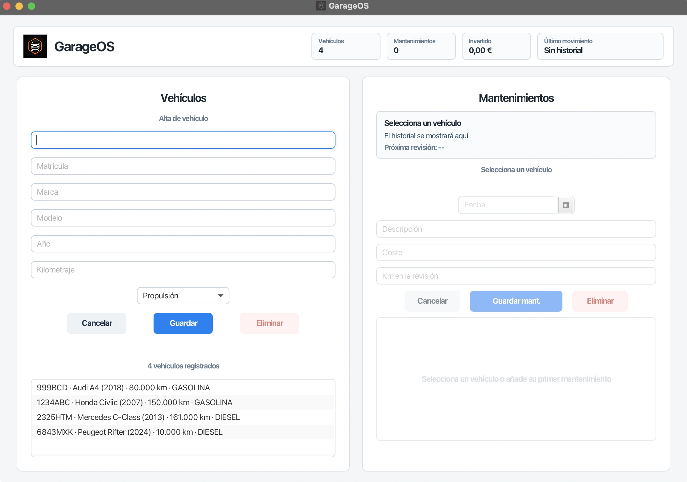

# GarageOS


GarageOS es una aplicación de escritorio para llevar el control básico de una pequeña flota de vehículos: altas, edición, búsqueda, mantenimientos, costes e historial por matrícula.

El proyecto está hecho con JavaFX, FXML y SQLite. La idea no era solo tener un CRUD funcionando, sino montar una aplicación de escritorio presentable, con persistencia real, validaciones, interfaz cuidada y una estructura que se pueda explicar sin tener que esconder medio código debajo de la alfombra.



## Qué permite hacer

- Registrar vehículos con matrícula, marca, modelo, año, kilometraje y tipo de propulsión.
- Editar y eliminar vehículos existentes.
- Buscar vehículos por matrícula, marca, modelo o propulsión.
- Asociar mantenimientos a un vehículo concreto.
- Registrar fecha, descripción, coste y kilómetros de cada mantenimiento.
- Editar y eliminar mantenimientos.
- Ver un resumen global con vehículos, mantenimientos, inversión total y último movimiento.
- Ver una ficha del vehículo activo con datos básicos y próxima revisión sugerida.
- Guardar la información en SQLite.
- Validar los datos antes de guardarlos.

## Flujo de uso

1. Se registra un vehículo desde el panel izquierdo.
2. Al seleccionarlo, se activa el panel de mantenimientos.
3. Se añaden revisiones, reparaciones o gastos asociados a esa matrícula.
4. La aplicación actualiza el historial, el gasto acumulado y el resumen superior.
5. Si un vehículo se elimina, también se eliminan sus mantenimientos asociados.

## Estado actual

La aplicación ya tiene el flujo principal montado: vehículos, mantenimientos, base de datos, validaciones, estilos y pruebas unitarias.

Todavía quedan mejoras posibles, sobre todo en la parte de producto: empaquetado final, más cobertura de tests, exportación de datos, recordatorios reales o estadísticas más completas. Aun así, el proyecto ya es ejecutable y usable como aplicación de escritorio.

## Tecnologías

- Java 21
- JavaFX 21
- FXML
- Scene Builder
- SQLite
- Maven
- JUnit 5

## Estructura

El proyecto está separado por capas para que cada parte tenga una responsabilidad clara:

```txt
src/main/java/io/github/diegoalegil/garageos
├── PrincipalApplication.java
├── controllers
│   └── PrincipalController.java
├── models
│   ├── Mantenimiento.java
│   ├── TipoPropulsion.java
│   └── Vehiculo.java
├── repositories
│   ├── MantenimientoRepository.java
│   ├── VehiculoMemoryRepository.java
│   ├── VehiculoRepository.java
│   └── sqlite
│       ├── MantenimientoSqliteRepository.java
│       ├── SQLiteConnectionManager.java
│       └── VehiculoSqliteRepository.java
├── services
│   ├── MantenimientoService.java
│   └── VehiculoService.java
└── utils
    └── Validacion.java
```

La interfaz vive en:

```txt
src/main/resources/io/github/diegoalegil/garageos
├── principal-view.fxml
├── styles.css
└── assets
```

## Cómo ejecutarlo

Necesitas tener instalado Java 21 y Maven.

```bash
mvn javafx:run
```

Al arrancar, la aplicación usa una base de datos local en:

```txt
data/garageos.db
```

Esa base de datos está ignorada por Git porque es información local de ejecución.

## Tests

Para ejecutar las pruebas:

```bash
mvn test
```

Ahora mismo hay tests para:

- Validaciones de vehículos y mantenimientos.
- Formato de salida de modelos.
- Repositorio en memoria de vehículos.

Última comprobación local: 20 tests en verde.

## Decisiones del proyecto

### SQLite como persistencia local

SQLite encaja bien porque la app es de escritorio y no necesita un servidor externo para guardar datos. El fichero de base de datos se crea dentro de `data/`, así el proyecto puede ejecutarse sin configurar nada raro.

### FXML para separar vista y lógica

La interfaz está definida en `principal-view.fxml`, mientras que el comportamiento está en `PrincipalController.java`. Esto hace que el diseño visual y la lógica no estén mezclados en el mismo archivo.

### Services y repositories

El controlador no habla directamente con SQLite. Pasa por servicios y repositorios:

- El controlador recoge datos de la interfaz.
- El servicio coordina la operación.
- El repositorio guarda o lee de SQLite.

Esa separación ayuda a mantener el proyecto más ordenado y facilita añadir pruebas.

### Validaciones antes de guardar

La clase `Validacion` concentra reglas como:

- Matrícula obligatoria y con formato válido.
- Año dentro de rango.
- Kilometraje no negativo.
- Fecha de mantenimiento no futura.
- Coste y kilómetros de mantenimiento válidos.

## Qué he trabajado en este proyecto

Este repositorio me ha servido para practicar varias partes que normalmente aparecen separadas en ejercicios pequeños:

- Conectar una interfaz JavaFX con un controlador.
- Usar FXML y Scene Builder sin perder el control del código.
- Persistir información con SQLite.
- Separar modelos, servicios y repositorios.
- Trabajar con `LocalDate`, `Optional`, listas y validaciones.
- Escribir tests unitarios con JUnit.
- Pulir una interfaz hasta que sea razonablemente cómoda de usar.

## Assets

Las imágenes del proyecto están en `img/` y se usan principalmente para documentación y presentación del repositorio.


## Próximos pasos

- Mejorar el empaquetado para ejecutar la app de forma más cómoda.
- Añadir más pruebas sobre servicios y repositorios SQLite.
- Preparar capturas finales para la entrega.
- Añadir estadísticas reales a partir de los mantenimientos.
- Estudiar un sistema de recordatorios de próxima revisión.

## Autor

Proyecto desarrollado por Diego Alegil como práctica de aplicación de escritorio con JavaFX, FXML y SQLite.
